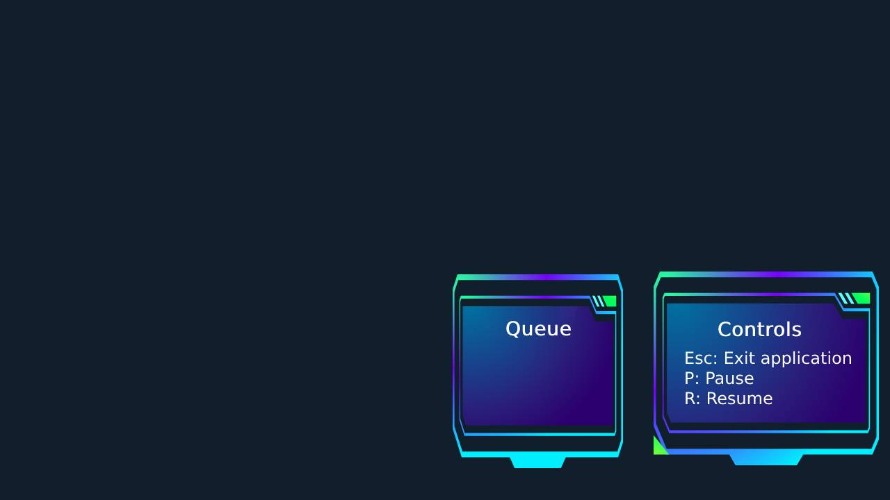

# Setup

The setup of the software on the client's machines is handled as part of the service. Nevertheless, the steps involved are as follows:

1. Clone the project repository to your local machine.

```bash
git clone https://github.com/JIAOJIAOMEI/VigilHeat-project.git
```
2. Navigate to the project directory.

```bash
cd VigilHeat-project/
```

3. Execute the Docker image. This step is automated by the service to create a shortcut, enabling the client to initiate the software with a simple double-click.

```bash
xhost +
export DISPLAY=:1
docker build -t vigilheat .
docker run -v /tmp/.X11-unix:/tmp/.X11-unix -e DISPLAY=$DISPLAY -it vigilheat
```

# User guide

The software is straightforward to operate. Simply launch it and it will start processing images in real-time, collecting and storing the information in a CSV file. The instructions to pause and restart the software will be displayed on the screen.


(A photo is not shown with the video operating due to the privacy clause. For a better idea please refer to the video attached in the delivery.)

# Project structure

To facilitate the evaluation of the project, here is the structure based on the files:

```bash
- Dockerfile: A file containing the instructions for building the Docker image.
- main.py: The main script responsible for running the people counting system.
- stream_handler.py: A module that handles video streaming and frame processing.
- heatmap_generator.py: A module that generates a heatmap based on the detected people.
- person_detector.py: A module containing the implementation of the person detection algorithm.
- histogram_generator.py: A module that generates a histogram based on the people count data.
- requirements.txt: A file listing the required dependencies for the project.
- people_counting_at_cashier.py: A script that demonstrates the people counting system at a cashier location.
- yolov8l.pt: A pre-trained YOLOv8 model's weight file for object detection.

```

To know more about the people_counting_at_cashier you can refer to the following file: [people_counting_at_cashier](README_PEOPLE_COINTING.md)

## Plus version

In the Plus version, you have access to a control panel where you can monitor real-time people flow and the status of people at the cashier area. Additionally, you retain all the rights and benefits available in the free version. With the Plus version, the following features are available:

1. Real-time Monitoring: The control panel provides a live view of the people flow, allowing you to track the movement and density of people in different areas. This helps you gain insights into the overall crowd dynamics and make informed decisions.
2. Cashier Area Monitoring: The control panel includes a dedicated section to monitor the specific area around the cashier. This enables you to keep track of the number of people at the cashier, assess queue lengths, and optimize staffing accordingly.
3. Additional Analytical Insights: The Plus version may provide additional analytical features and visualizations to help you understand patterns, trends, and peak hours of people flow. These insights can assist in optimizing operations and resource allocation.
4. Continued Free Version Benefits: Despite upgrading to the Plus version, you retain all the rights and benefits available in the free version. This includes real-time alerts for upper and lower limits, email notifications, and the ability to track people count within a user-defined ROI.

If you would like a clearer teaser video of the project, you can find a video demonstration in the "output_video.mp4" file located in the "source code" folder. The following is a just compressed gif.


```python
python3 main.py
```

# reference

https://github.com/saimj7/People-Counting-in-Real-Time

https://github.com/ultralytics/ultralytics
