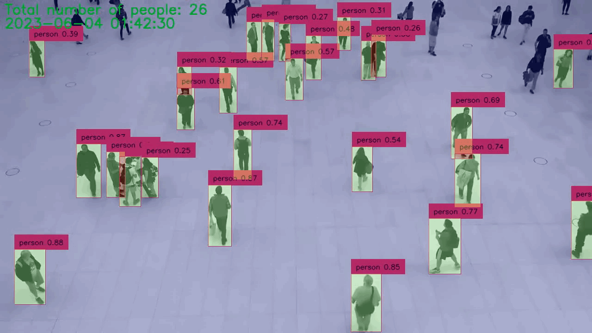
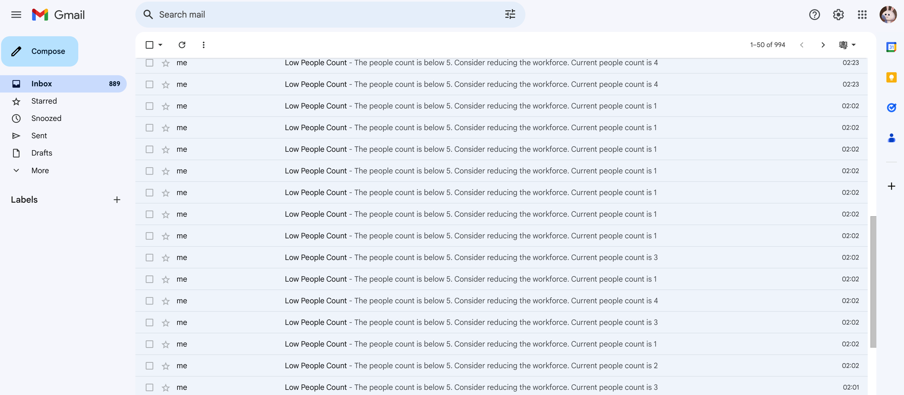
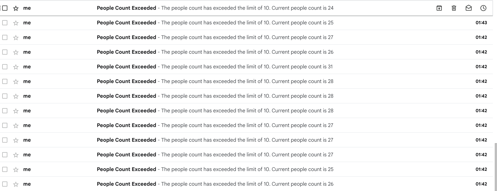
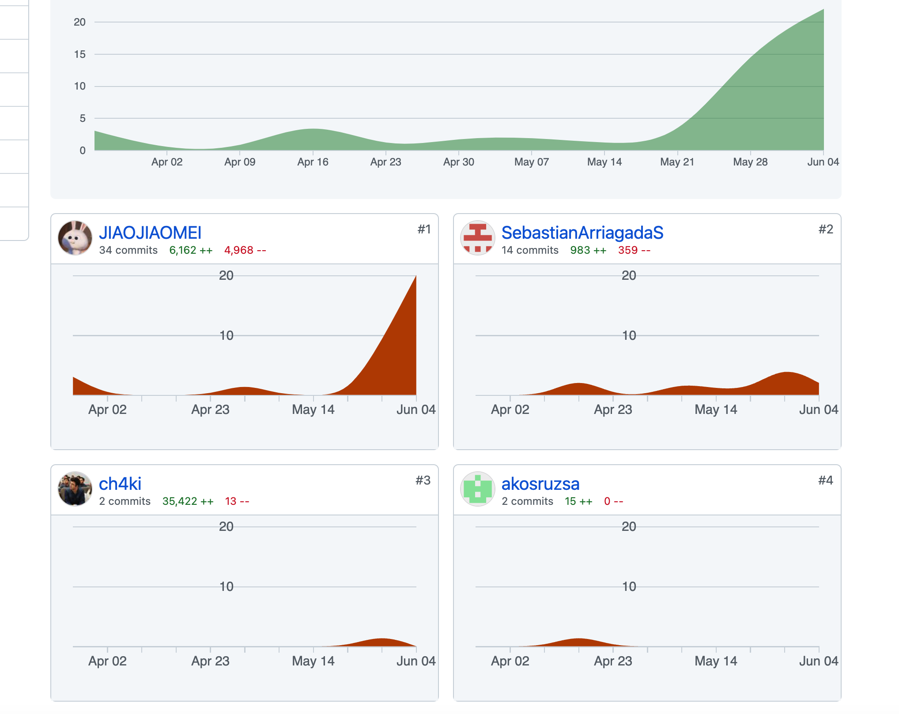

# Setup

The setup of the software on the client's machines is handled as part of the service. Nevertheless, the steps involved are as follows:

1. Clone the project repository to your local machine.

```bash
git clone https://github.com/JIAOJIAOMEI/VigilHeat-project.git
```
2. Navigate to the project directory.

```bash
cd VigilHeat-project/
```

3. Execute the Docker image. This step is automated by the service to create a shortcut, enabling the client to initiate the software with a simple double-click.

```bash
xhost +
export DISPLAY=:1
docker build -t vigilheat .
docker run -v /tmp/.X11-unix:/tmp/.X11-unix -e DISPLAY=$DISPLAY -it vigilheat
```

# Project structure

To facilitate the evaluation of the project, here is the structure based on the files:

```bash
- Dockerfile: A file containing the instructions for building the Docker image.
- main.py: The main script responsible for running the people counting system.
- stream_handler.py: A module that handles video streaming and frame processing.
- heatmap_generator.py: A module that generates a heatmap based on the detected people.
- person_detector.py: A module containing the implementation of the person detection algorithm.
- histogram_generator.py: A module that generates a histogram based on the people count data.
- requirements.txt: A file listing the required dependencies for the project.
- people_counting_at_cashier.py: A script that demonstrates the people counting system at a cashier location.
- yolov8l.pt: A pre-trained YOLOv8 model's weight file for object detection.

```

# Teaser Images/video

## Free plan

### general people counting



### general people counting and object detections


### People counting at a specific area


### Sending notifications in real time

If you use the free version, you will receive real-time alerts when the number of people reaches certain upper and lower limits, and these alerts will be sent via email.





### if you consider a free plan

```python
# Run with a specific input video file
python3 people_counting_at_cashier.py --input input_video.mp4

# Use a webcam as input:
python3 people_counting_at_cashier.py --input webcam

# Set the webcam resolution:
python3 people_counting_at_cashier.py --webcam-resolution 1280 720

# Specify an output video file:
python3 people_counting_at_cashier.py --input input_video.mp4 --output path/to/output.mp4

# Adjust the number of frames to skip:
python3 people_counting_at_cashier.py --input input_video.mp4 --output path/to/output.mp4 --skip-frames 5

# People counting and object detections:
python3 people_counting_at_cashier1.py --input input_video.mp4

# Enable email notifications and provide an email address:
python3 people_counting_at_cashier.py --input input_video.mp4 --output path/to/output.mp4 --email your-email@example.com
```

Replace the **YOUR_EMAIL** variable with your email address, and generate an application-specific password from your email service provider (e.g., Google) to authenticate the script without revealing your actual account password. 

```python
YOUR_EMAIL = "your-email@example.com"
YOUR_PASSWORD = "your-generated-application-specific-password"
```

## Plus version

In the Plus version, you have access to a control panel where you can monitor real-time people flow and the status of people at the cashier area. Additionally, you retain all the rights and benefits available in the free version. With the Plus version, the following features are available:

1. Real-time Monitoring: The control panel provides a live view of the people flow, allowing you to track the movement and density of people in different areas. This helps you gain insights into the overall crowd dynamics and make informed decisions.
2. Cashier Area Monitoring: The control panel includes a dedicated section to monitor the specific area around the cashier. This enables you to keep track of the number of people at the cashier, assess queue lengths, and optimize staffing accordingly.
3. Additional Analytical Insights: The Plus version may provide additional analytical features and visualizations to help you understand patterns, trends, and peak hours of people flow. These insights can assist in optimizing operations and resource allocation.
4. Continued Free Version Benefits: Despite upgrading to the Plus version, you retain all the rights and benefits available in the free version. This includes real-time alerts for upper and lower limits, email notifications, and the ability to track people count within a user-defined ROI.

If you would like a clearer teaser video of the project, you can find a video demonstration in the "output_video.mp4" file located in the "source code" folder. The following is a just compressed gif.


```python
python3 main.py
```


# MVP scope completion

## High Priority

1. Monitoring customer flow during peak hours: The code successfully counts the number of people detected in the video or webcam feed, providing valuable insights into customer flow. **Completion: 100%**
2. Predicting peak hours:  It records and saves the people flow data hourly. This data can be analyzed to identify patterns and make informed predictions about peak hours. **Completion: 100%**
3. The code sends real-time email notifications when the people count exceeds or falls below specific thresholds, allowing for prompt identification of potential queue length issues. **Completion: 100%**

## Medium Priority

1. Analyzing checkout lane efficiency: The current code does not directly analyze checkout lane configurations or measure efficiency. However, by manually analyzing the recorded people flow data, insights can be gained regarding checkout lane utilization, bottlenecks, and areas for improvement. **Completion: 30-50% (Manual analysis possible using recorded data)**
2. Reviewing staff performance during peak hours:  The code does not include specific functionality for analyzing staff performance. However, by correlating the recorded people flow data with staffing schedules, staff availability can be evaluated during peak hours, providing a basis for assessing their effectiveness. **Completion: 30-50% (Manual analysis possible using recorded data and staffing schedules)**

## Low Priority

1. Tracking customer satisfaction levels: The code does not have dedicated functionality for tracking customer satisfaction levels. However, by leveraging email notifications sent to customers, a brief survey or feedback form can be included to gather valuable insights and feedback. **Completion:30%( Potential for gathering customer feedback through email notifications).**
# Target KPI realization
Our Target User KPIs for the end of the semester are: 

1. Detection accuracy of at least 75%. 
2. Detection frequency of at least 10 frames per second. 

To validate if the open-source object detection models are suitable for our project, we retrained a YOLO model. Impressively, we attained a detection accuracy of 85%, which exceeded our initial goal of 75%. This result clearly demonstrates the model's proficiency in accurately recognizing and detecting objects.

We have determined that an optimal configuration would be to set the processing rate at 10 frames per second. This decision helps us to avoid generating excess information and allows the program to operate without demanding high-end hardware requirements, including the need for a GPU.

In summary, we have accomplished our goals by achieving exceptional detection accuracy and ensuring real-time processing capabilities in our system.

# A screenshot for the commits



# For other assignments

**Team is Ready for Action (PDF of idea submitted)**: Jiaojiao took the initiative to draft the entire PDF document outlining our project idea. The other team members provided some suggestions, and made minor modifications.

**Market, Users & KPIs**: Jiaojiao initially drafted the PDF document for this section, and the other team member, Arriagada Silva Sebastián Ignacio, made significant revisions to it.

**User Interviews & Stories**: The main responsibility for this task was undertaken by Rúzsa Ákos, including conducting user interviews and writing the corresponding documentation.

**MVP User Stories**: Arriagada Silva Sebastián Ignacio took the lead in drafting the initial PDF document for this section, and Jiaojiao subsequently made significant additions and modifications.

**Retrospective**: Jiaojiao doesn't know or remember this one.

**The code**: see the contribution.

# reference

https://github.com/saimj7/People-Counting-in-Real-Time

https://github.com/ultralytics/ultralytics
