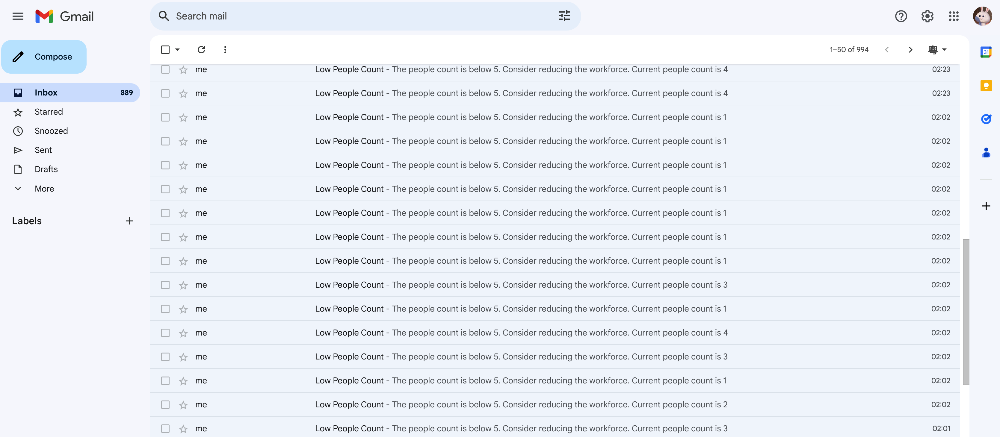
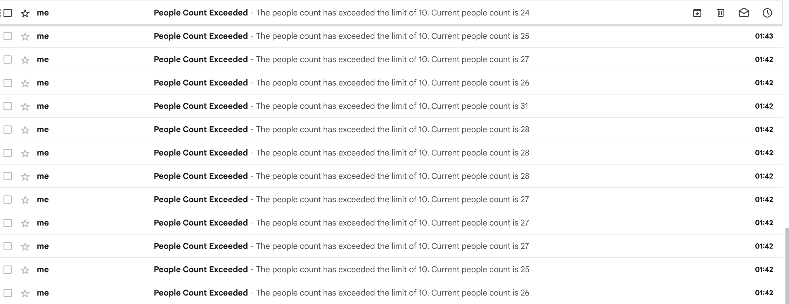

# Teaser Images/video


### general people counting


### general people counting and object detections


### People counting at a specific area


### Sending notifications in real time

If you use the free version, you will receive real-time alerts when the number of people reaches certain upper and lower limits, and these alerts will be sent via email.





### if you consider a free plan

```python
# Run with a specific input video file
python3 people_counting_at_cashier.py --input input_video.mp4

# Use a webcam as input:
python3 people_counting_at_cashier.py --input webcam

# Set the webcam resolution:
python3 people_counting_at_cashier.py --webcam-resolution 1280 720

# Specify an output video file:
python3 people_counting_at_cashier.py --input input_video.mp4 --output path/to/output.mp4

# Adjust the number of frames to skip:
python3 people_counting_at_cashier.py --input input_video.mp4 --output path/to/output.mp4 --skip-frames 5

# People counting and object detections:
python3 people_counting_at_cashier1.py --input input_video.mp4

# Enable email notifications and provide an email address:
python3 people_counting_at_cashier.py --input input_video.mp4 --output path/to/output.mp4 --email your-email@example.com
```

Replace the **YOUR_EMAIL** variable with your email address, and generate an application-specific password from your email service provider (e.g., Google) to authenticate the script without revealing your actual account password.

```python
YOUR_EMAIL = "your-email@example.com"
YOUR_PASSWORD = "your-generated-application-specific-password"
```
